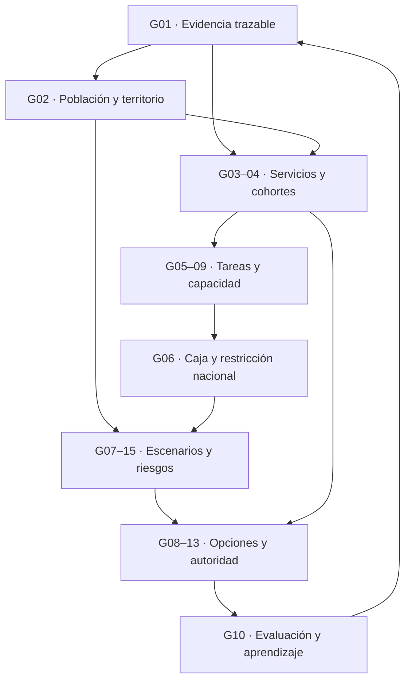

# Venezuela Futura — Gap Map y Research Backlog

**Primera fase de revisión e investigación · 5 de octubre de 2026**

**Estado:** entrega para discusión. No es un programa de gobierno ni una selección de inversiones. Las propuestas de investigación y transferencia institucional permanecen abiertas a contraste.

**Repositorio examinado:** [kubrick06010/Venezuela-Futura](https://github.com/kubrick06010/Venezuela-Futura), instantánea `583787ed08fc49b6bb83e6cd830822c39b6bc27d`, último commit fechado el 4 de octubre de 2026. El diagnóstico inicial se realizó en modo de lectura. Posteriormente el usuario autorizó modificaciones y commits incrementales; los bloques incorporados se mantienen provisionales en una rama de investigación. La instantánea indicada es la base del análisis, anterior a esos cambios.

## 1. Resultado principal

**Venezuela Futura tiene una arquitectura conceptual más avanzada que su infraestructura de evidencia y decisión.** Su principal carencia no es desconocer las conexiones entre nutrición, aprendizaje, capacidades, mantenimiento, territorio, diáspora e instituciones. Muchas ya están formuladas, con salvaguardas expresas. Falta recorrerlas con datos comparables, mecanismos contrastados, costes sostenibles, responsabilidades y criterios de revisión.

El salto de conocimiento más valioso sería completar **una primera cadena verificable desde una necesidad humana hasta una decisión revisable**, mientras se investigan en paralelo las restricciones nacionales que podrían invalidar cualquier solución local. Un piloto territorial no sustituye demografía, financiación nacional, clima, economía política ni desarrollo infantil.

Cinco investigaciones concentran el mayor poder de desbloqueo:

1. **Evidencia utilizable:** qué mide cada cifra, a quién representa, de qué fecha es y para qué comparación sirve.
2. **Servicio y población realmente atendida:** qué restricciones coinciden en un territorio y cómo afectan derechos, aprendizaje y vida cotidiana.
3. **Capacidad sostenible:** qué activos, tareas, personas, insumos, caja y divisas hacen falta para mantener ese servicio.
4. **Opciones bajo incertidumbre:** cómo cambia la elección ante demografía, clima, restricciones fiscales y fallos correlacionados.
5. **Capacidad de corregir legítimamente:** quién observa, quién decide, quién financia, quién puede impugnar y qué intereses pueden bloquear una corrección.

Estas prioridades investigadoras **no son una secuencia que obligue a posponer protección, nutrición o servicios urgentes** hasta disponer de estadísticas perfectas. La investigación debe acompañar y mejorar la acción, especialmente cuando esperar produce daños irreversibles.

## 2. Alcance, evidencia y límites de esta revisión

Se revisó el corpus de **48 documentos Markdown**, aproximadamente 31.600 palabras, las relaciones y la arquitectura declarada. Incluye principios, método editorial, contexto, sociedad, memoria, pensamiento, territorio, ocho trayectorias institucionales, capacidades, diseño institucional y los cinco documentos de estado del país. Se inspeccionaron `data/relations.json` y la estructura de datos; no se auditó la interfaz web.

La coincidencia entre agentes que comparten corpus o fuentes no constituye verificación independiente. La investigación se organizó en cinco líneas paralelas por mecanismo —evidencia; capacidades humanas; sistemas materiales; planificación y gobernanza; redes, diáspora y confianza— y una sexta revisión crítica de su integración. Se cruzaron especialmente escuela–hogar–servicios y cooperación–absorción–gobernanza. Los resultados siguientes integran esas líneas; no son seis informes pegados.

La auditoría externa es **selectiva**, orientada a afirmaciones y decisiones de mayor impacto. No se verificó cada hecho histórico, no se extrajeron microdatos ENCOVI ni expedientes completos de activos, y no se realizaron entrevistas o mediciones de campo. Algunos documentos sólo fueron recuperables parcialmente o mediante índices de búsqueda; se señala donde afecta la conclusión. Un acceso fallido no se trató como prueba de falsedad.

Etiquetas de lectura:

| Etiqueta | Significado |
|---|---|
| Documentado | El repositorio o una fuente identificable contiene la afirmación; no equivale automáticamente a verdad exhaustiva o eficacia. |
| Observado | Medición o registro con población, momento y método definidos. |
| Estimado / proyectado | Resultado de modelo o extrapolación; conservar supuestos y versión. |
| Interpretación | Lectura explicativa que debe admitir alternativas. |
| Hipótesis | Mecanismo o efecto todavía por contrastar, especialmente su magnitud venezolana. |
| Propuesta normativa | Elección sobre derechos, fines o reglas; no presentarla como conclusión estadística. |
| No verificado | Evidencia insuficiente en esta revisión; no significa refutado. |

## 3. Arquitectura intelectual que ya existe

La pregunta matriz del README es cómo recuperar la capacidad de imaginar, decidir, construir, mantener y mejorar el futuro. El proyecto combina cuatro funciones: memoria histórica, interpretación plural, diagnóstico del presente y preparación de alternativas intergeneracionales. Sus límites —derechos, dignidad, territorio, pluralismo y legitimidad— están formulados antes de la optimización económica.

Su estructura actual puede reconstruirse así:

| Eslabón de la arquitectura solicitada | Estado en esta instantánea | Evidencia del repositorio | Hueco real |
|---|---|---|---|
| Estado actual | Desarrollado como barrido narrativo y cifras heterogéneas | `08-estado-del-pais/`, cinco documentos | Registro reproducible, territorios, comparabilidad y actualizaciones |
| Futuros plausibles | Esbozado | `06-capacidades/README.md`, horizontes; `sources/predecessors.md` | Escenarios venezolanos con supuestos, incertidumbres y pruebas de estrés |
| Servicios/outcomes deseados | Principios sólidos; especificación incompleta | `00-principios/`, `sistemas-esenciales.md` | Niveles de servicio, distribución, prioridades deliberadas y medición |
| Capacidades necesarias | Marco amplio y buenas distinciones | `06-capacidades/`, `capacidad-material-2026.md` | Tareas, competencias, disponibilidad, instituciones receptoras y costes |
| Brechas | Numerosas preguntas explícitas | Pendientes de capa humana, material y territorial | Magnitud, criticidad y dependencias comprobadas |
| Opciones | Método declarado | README, `06-capacidades/` | Comparaciones concretas, contrafactuales y criterios de admisibilidad |
| Hojas de ruta adaptativas | Principio explícito | `06-capacidades/README.md`, revisión y cancelabilidad | Señales, umbrales, plazos de respuesta, autoridad y financiación |
| Programas/proyectos | Distinción conceptual inicial | NASA y capacidad residual en `06-capacidades/` | Gestión de beneficios, coordinación, recursos compartidos y selección de cartera |
| Operación y mantenimiento | Muy presente como principio | `00-principios/`, sistemas, EDELCA, INOS, Metro | Condición de activos, tareas, repuestos, personal y caja recurrente |
| Outcomes observados | Fragmentos de diagnóstico | ENCOVI y algunos indicadores de servicio | Seguimiento comparable, distribución y atribución de efectos |
| Evaluación | Plantillas y preguntas | README y Gran Viraje | Casos completos de previsión–resultado–respuesta |
| Aprendizaje | Intención y memoria de Git | CONTRIBUTING, trayectorias, casos | Registro de qué evidencia cambió qué decisión y qué ocurrió después |

**Ausencia estructural comprobada:** `09-futuros/`, `10-opciones/`, `11-hojas-de-ruta/` y `12-evaluacion/` están anunciados en el README, pero no contienen directorios/documentos en la instantánea revisada. Eso no implica ausencia total de sus conceptos: parte del contenido está dentro de capacidades y casos.

El grafo contiene **65 relaciones**: 39 etiquetadas documentadas, 24 interpretativas y 2 inferidas. Sus campos son origen, destino, tipo y confianza. No incorpora por arista una fuente, localizador, periodo o condición de validez. CONTRIBUTING remite correctamente al respaldo en Markdown; falta poder seguir de forma consistente esa conexión. **El grafo es principalmente intelectual e histórico, no un modelo de dependencias operativas o causalidad.**

43 de los 48 Markdown no contienen una URL. Es un indicador de trabajo de trazabilidad pendiente, no una medida automática de calidad: existen referencias bibliográficas impresas y documentos deliberadamente normativos.

## 4. Gap Map priorizado

La prioridad combina alcance del bloqueo, probabilidad de cambiar una decisión, daño de equivocarse y factibilidad de obtener evidencia. No se asigna una puntuación numérica porque produciría una precisión que no tenemos. **CRÍTICO** significa bloqueo transversal o condición necesaria antes de comprometer recursos; **IMPORTANTE**, mejora relevante que puede avanzar junto al núcleo; **SECUNDARIO**, diferible en esta fase, sin juzgar el valor cultural del tema.

Los IDs G01–G18 enlazan con el backlog de la sección 9. «Multibloqueo» indica que una respuesta desbloquea varias ramas.

| Hueco | Por qué importa | Qué sabemos | Qué falta | Dependencias | Fuentes/datos necesarios | Investigación propuesta | Impacto |
|---|---|---|---|---|---|---|---|
| **G01. Registro de afirmaciones y versiones** | Evita construir modelos con cifras incompatibles | El método exige fechas y límites; ejecución irregular | Fuente exacta, tabla, universo, versión, incertidumbre y decisiones que usan el dato | Ninguna | Documentos originales y metadatos | Auditar primero 20 afirmaciones decisivas | **CRÍTICO · multibloqueo de todas las ramas** |
| **G02. Demografía y denominadores territoriales** | Dimensiona servicios, cuidados y formación | Población incierta reconocida; estructura de edades aproximada | Mismo año, residencia, cohortes, hogares, migración y sensibilidad territorial | G01 | WPP, WEO, ENCOVI, registros vitales y marcos territoriales | Reconciliar conceptos; mantener escenarios distintos | **CRÍTICO · demanda de todos los sistemas** |
| **G03. Servicio efectivo y fallos conjuntos** | Un activo no revela qué recibe la gente | Nexo agua–energía–salud–escuela ya explícito | Series simultáneas de disponibilidad, calidad, personal y consecuencias | G01–02 | Operadores, hogares, escuelas, salud, JMP | Piloto de observación de un circuito funcional | **CRÍTICO · salud, educación, resiliencia, producción** |
| **G04. Cohortes humanas y aprendizaje** | La cadena nutrición–competencia tarda años y tiene varias causas | Mecanismo planteado; ENCOVI describe restricciones | Nutrición, cuidados, desarrollo, horas de clase, aprendizaje y seguimiento | G01–03 | UCAB, UNICEF/WFP, salud primaria, evaluaciones educativas | Diseños separados para primera infancia y recuperación escolar | **CRÍTICO · capacidad futura; no una ecuación determinista** |
| **G05. Activos, tareas y competencias disponibles** | Puede faltar un técnico o repuesto que inutilice un sistema | Inventario conceptual distingue nominal/disponible/recuperable | Condición, mantenimiento diferido, tareas, turnos, supervisión, sustitutos | G03 | Bitácoras, inspección, empleadores, universidades, talleres | Inventario por criticidad y demostración práctica | **CRÍTICO · cartera, formación y diáspora** |
| **G06. Caja, financiación pública y divisas** | Una opción útil puede ser imposible de sostener | CAPEX/OPEX y dependencia exterior mencionados | Gastos recurrentes, pasivos, ingresos asignables, exposición cambiaria y capacidad de compra | G01, G03, G05 | Presupuestos, ejecución, deuda, BCV, cuentas de operadores, precios trazables | Modelo nacional de restricciones + caja local de ciclo de vida | **CRÍTICO · toda opción de inversión/servicio** |
| **G07. Escenarios y metabolismo físico** | Evita proyectar consumo restringido como necesidad futura | Secuencia población–servicios–recursos ya propuesta | Balances por territorio y escenario; límites ecológicos; importaciones netas | G02–03, G05–06 | Demografía, agua, energía, alimentos, materiales, logística y clima | Empezar con balances acoplados; ampliar por sensibilidad | **CRÍTICO antes de una cartera nacional** |
| **G08. Regla de decisión y revisión democrática** | Continuidad y cancelación pueden entrar en conflicto | Cancelabilidad y derechos explícitos | Señal, umbral, plazo, autoridad, recurso, presupuesto y protección durante cambio | G03, G06–07 | Mandatos, contratos, experiencias Delta/NZ/Gales | Simular decisiones reversibles e irreversibles | **CRÍTICO · conecta conocimiento con acción legítima** |
| **G09. Absorción local y capacidad residual** | Más visitas, títulos o cooperación no garantizan autonomía | Becas y diáspora vinculadas conceptualmente a instituciones | Equipo receptor, tareas, insumos, tiempo y ejecución posterior autónoma | G05–06, G08 | RAICES y expedientes de cooperación locales | Comparar colaboración remota, temporal, retorno y formación local | **CRÍTICO antes de escalar cooperación; no bloquea protección** |
| **G10. Cartera, clases de referencia y aprendizaje** | Reduce optimismo y competencia oculta por recursos | Gran Viraje tiene buen método; trayectorias son esqueletos | Previsiones originales, cambios, costes, demanda, cancelaciones y respuesta ex post | G01, G05–08 | Expedientes venezolanos, Chile SNI, NASA/GAO | Dos casos completos y un caso fallido/cancelado | **IMPORTANTE · calidad de siguientes decisiones** |
| **G11. Integración regional por función** | Un convenio sólo sirve si produce acceso efectivo | Cooperación/diversificación definidas | Elegibilidad, interoperabilidad, costes, reciprocidad y continuidad real | G05–09 | CAN, Mercosur, redes científicas, energía/logística, autoridades | Seguir un flujo de extremo a extremo | **IMPORTANTE · ciencia, movilidad y soberanía efectiva** |
| **G12. Vida disponible y distribución** | Ingreso/PIB ocultan tiempo, cuidado, inseguridad y exclusión | Capa humana menciona costes de participar/trabajar | Tiempo, dinero, atención, seguridad y derechos por grupo | G02–04 | Diarios de tiempo, trayectos, hogares, accesibilidad | Medir vector; no índice único ni monetización obligatoria | **IMPORTANTE · cambia evaluación de beneficios** |
| **G13. Economía política y capacidad civil del Estado** | Saber qué hacer no asegura poder corregir | Seguridad e incentivos profesionales están más desarrollados | Compras, regulación, capacidad fiscal, vetos, captura y coordinación multinivel | G06, G08 | Casos COPRE/INOS/Gran Viraje, ejecución y contratos | Mapear función–actor–incentivo–autoridad–control | **CRÍTICO para ejecución; transversal** |
| **G14. Confianza, voz y pertenencia** | El relato no sustituye experiencia ni derechos | Pluralismo y no instrumentalización expresos | Series comparables, mecanismos y grupos no representados | G01, G03, G12–13 | Latinobarómetro, WVS, encuestas de servicio, organizaciones migrantes | Comparación temporal + observación de respuesta a quejas | **IMPORTANTE · legitimidad y convivencia** |
| **G15. Clima, riesgos y fallos correlacionados** | Diversificar equipos no basta si comparten el mismo fallo | Resiliencia, holgura y geografía bien formuladas | Amenazas por cuenca/corredor, coincidencias, autonomía y ventanas de adaptación | G02–03, G05, G07 | Hidrometeorología, riesgo sísmico, PDNA, datos ambientales | Stress tests de sequía, inundación, energía y logística | **CRÍTICO para activos duraderos; multibloqueo** |
| **G16. Derechos, territorio y efectos del éxito** | Mejorar un servicio puede desplazar daños o excluir | Límites fuertes; éxito excesivo mencionado | Distribución, saneamiento, demanda inducida, acceso a suelo y voces locales | G03, G07–08, G12 | Comunidades, pueblos indígenas, evaluaciones ambientales y urbanas | Criterios de exclusión y alternativas antes del ranking | **IMPORTANTE; salvaguarda inmediata para toda investigación** |
| **G17. Cartografía editorial y duplicidades** | La repetición puede ocultar qué versión prevalece | Principios reiterados; focos/caso Gran Viraje se complementan | Ancla por concepto, registro de controversias, cambios y referencias cruzadas | G01 | Corpus y grafo | Proponer mapa de documentos sin editar todavía | **IMPORTANTE · evita divergencias futuras** |
| **G18. Ampliar catálogos de autores, países y obras** | Puede aportar contexto, pero no siempre cambia decisiones | Listas extensas de antecedentes | Caso de uso concreto y evidencia de mecanismo | Pregunta decisiva previa | Obras originales y expedientes | Diferir ampliación general; investigar sólo comparadores necesarios | **SECUNDARIO en esta fase** |

### Dependencias que conviene resolver juntas

El esquema representa dependencias de investigación, no causalidades históricas demostradas. Derechos, participación y pluralismo atraviesan todos los nodos.

## 5. Auditoría: qué sabemos y qué sigue abierto

### Cifras y afirmaciones decisivas

| Hallazgo | Evidencia y estado | Implicación |
|---|---|---|
| Internet: 77% en 2024 frente a 61,6% en datos de finales de 2025 | Los dos valores aparecen en las fuentes citadas: Banco Mundial/ITU y DataReportal/Kepios. **Divergencia entre series**, no caída demostrada. [S01–S02] | No restar, promediar ni usar cualquiera como denominador único de digitalización. |
| Daños sísmicos: USD 6.700 millones | PNUD, 11-08-2026, confirma estimación preliminar de daños directos. La actualización PDNA del 15-09 distingue USD 14.831 millones de daños y pérdidas y hasta USD 21.000 millones de necesidades. **No son magnitudes equivalentes.** [S03–S04] | Actualizar categorías y horizonte antes de valorar recuperación; necesidades no equivalen a patrimonio destruido. |
| ENCOVI 2025 | La síntesis UCAB respalda muestra de 11.352 hogares y pobreza monetaria de hogares de 68,5%, extrema 31,7%; no son tasas de personas. Ficha/microdatos y comparabilidad con 2024 pendientes. [S05–S06] | Una muestra mayor no garantiza comparabilidad. Conservar filtros, pesos y errores antes de cuantificar cambios. |
| Población | El repo compara años y revisiones diferentes. La página actual del Banco Mundial presenta 28.516.896 habitantes para 2025. El valor FMI de 26,89 millones de 2026 no pudo recuperarse de la página dinámica en esta revisión. [S01, S07] | No refutarlo por inaccesibilidad. Recuperar edición WEO y comparar mismo año/concepto. No restar automáticamente stock de diáspora. |
| Electricidad instalada/disponible | Se localizó el reportaje Reuters citado; no se auditó inventario técnico. Otra publicación de septiembre usa un total instalado diferente. [S08] | Fuente periodística útil para diagnóstico; insuficiente para capacidad firme por central o plan de inversión. |
| Aprendizaje SECEL | UCAB describe organizaciones participantes, mayormente privadas, y siete ámbitos regionales. No acredita una muestra probabilística nacional. Su PDF muestra cifras distintas entre tablas y conclusiones, pendientes de aclaración. [S09] | No extrapolar a todo el alumnado venezolano ni fabricar una serie conciliada. Este hallazgo proviene de una fuente candidata, no de un error ya incorporado al repo. |
| Cobertura eléctrica y continuidad | Conexión a red y horas de suministro miden cosas diferentes | No hay contradicción lógica entre alta cobertura y servicio interrumpido. |

En el subconjunto auditado no se estableció que las cifras del repositorio fueran inventadas. Sí se comprobaron fuentes, actualizaciones, problemas de comparabilidad y límites de acceso. **Corroborar una fuente tampoco valida todos sus supuestos.**

### Contradicciones, tensiones y duplicidades internas

| Ubicación | Tipo | Tratamiento propuesto para una fase posterior |
|---|---|---|
| Gran Viraje, focos, líneas 29 y 155: inflación cercana a 60% frente a 35,5% en 1988 | Posible incompatibilidad de periodo/definición o error; sin resolver | Consultar tablas originales; no escoger una cifra por intuición. |
| Caso Gran Viraje, línea 283, pide cronología mensual; focos, línea 375, dice que no es necesaria | Diferencia editorial de alcance | Cronología precisa sólo donde esclarezca secuencia de precios, protección y respuesta; síntesis por mecanismos. |
| Capacidades, línea 94: «maximiza competencia real» | Tensión normativa con educación como derecho, cultura y ciudadanía | Ampliar finalidad educativa; la competencia productiva es una dimensión. |
| Escalera oficio→universidad→investigación | Riesgo de lectura jerárquica, pese a dignidad explícita de oficios | Representar itinerarios múltiples y cooperación lateral. |
| Capa humana, línea 128: «trabaja / participa» | Ambigüedad de definición | Separar ocupación, actividad y población en edad de trabajar; recuperar pregunta/filtro. |
| Edades 25%/60%/15% y dependencia aproximada de 65 | Redondeo/umbrales por comprobar, no contradicción demostrada | Documentar edades exactas y cifras sin redondear antes de recalcular. |
| Nutrición, diáspora, mantenimiento e identidad en varios documentos | Repetición parcialmente útil | Un ancla conceptual y enlaces a aplicaciones; actualizar una afirmación sin dejar copias divergentes. |
| Relaciones «documentadas» del grafo sin localizador propio | Déficit de trazabilidad, no refutación de relaciones | Asociar afirmación y fuente concreta; distinguir evidencia de la relación y evidencia de sus efectos. |

El caso Gran Viraje es más desarrollado que las ocho trayectorias institucionales. Estas últimas se reconocen como esqueletos: no debe presentarse todavía una teoría demostrada de por qué unas instituciones sobrevivieron y otras se deterioraron.

## 6. Investigación crítica: mecanismos y condiciones de transferencia

### 6.1 Base humana: ampliar la cadena sin convertirla en destino

La cadena del repositorio necesita tratar conjuntamente nutrición, salud, cuidado responsivo, estimulación, seguridad, tiempo de enseñanza y condiciones del hogar. El estudio guatemalteco de nutrición temprana siguió cuatro aldeas y recuperó datos económicos de alrededor del 60% de la cohorte inicial; sus resultados salariales no permiten aplicar un multiplicador universal a Venezuela. [S10]

El ensayo jamaicano encontró resultados adultos de una intervención de estimulación; el brazo de suplementación nutricional por sí solo no mostró efectos duraderos detectables en ese ensayo. No demuestra que la nutrición carezca de valor. Sí impide tratar calorías→salario como mecanismo automático. [S11]

Las evaluaciones de enseñanza según nivel real en India documentan intentos sin adopción docente y versiones eficaces con tiempo dedicado y apoyo. Formación impartida no equivale a práctica adoptada. [S12]

**Decisión que podría cambiar:** dedicar recursos a una combinación de servicios, cuidado y apoyo pedagógico, en lugar de asumir que basta comida, matrícula o capacitación aislada. Falta medir qué combinación limita a qué grupos en Venezuela. No declarar una «generación perdida» ni subordinar derechos educativos a productividad futura.

### 6.2 Sistemas: medir el servicio conjunto y su sostenibilidad

JMP distingue fuente mejorada de agua gestionada de forma segura mediante accesibilidad, disponibilidad cuando se necesita y ausencia de contaminación. Esta definición operacionaliza una intuición ya presente en el repositorio. [S13]

La investigación debe identificar la restricción que domina cada circuito: energía, desinfección, fugas, repuesto, operador, acceso vial o caja. No basta multiplicar porcentajes nacionales de agua, energía y personal suponiendo independencia. Hay que observar cuándo coinciden.

**Hipótesis nueva para contraste:** mantenimiento puede producir doble resultado —continuidad del servicio y aprendizaje técnico supervisado— si existen mentores, talleres, insumos y tareas reales. Sin ellos, aumentar matrícula técnica puede dejar intacta la restricción.

**Efectos del éxito que deben medirse:** más agua puede aumentar aguas servidas; mayor presión puede agravar fugas; mejor acceso puede inducir consumo, actividad o presión inmobiliaria. Respaldo solar reduce algunas dependencias y crea otras de reposición y mantenimiento. Ninguno de estos efectos está cuantificado aquí para Venezuela.

### 6.3 Largo plazo: proteger opciones y capacidad de revisión

Delta combina perspectivas de varias décadas, seguimiento y revisión; conserva estrategias alternativas y conecta reposición con cambios del entorno. Una decisión debe adelantarse al punto donde el servicio deja de cumplir objetivos, considerando el tiempo necesario para actuar. [S14]

Propuesta para investigar en Venezuela:

| Horizonte | Pregunta útil | Qué puede comprometerse |
|---|---|---|
| 5 años | ¿Qué servicio puede sostenerse y verificarse? | Recursos, responsables e hitos sujetos a revisión |
| 20–30 años | ¿Qué cohortes, capacidades y reposiciones hacen falta? | Rutas alternativas y preparación de competencias |
| 50 años | ¿Qué transformaciones territoriales/climáticas podrían invalidar una opción? | Reservas de opciones, límites y ventanas de adaptación |
| 75 años | ¿Qué irreversibilidades y obligaciones heredan otras generaciones? | Salvaguardas y escenarios, sin calendario obligatorio de obras |

La distinción es normativa y metodológica, no un pronóstico. El backcasting parte de varios futuros deseados debatidos, no de uno impuesto; los escenarios exploran circunstancias que pueden frustrarlos; las rutas adaptativas especifican cómo revisar decisiones. Una opción real sólo vale si se conserva material, financiera e institucionalmente la posibilidad de ejercerla.

Gales aporta un contrapeso: su auditor informó en 2025 que la ley de generaciones futuras aumentó la atención al tema, pero no produjo el cambio sistémico pretendido; señaló brechas en personal, activos, financiación y evaluación. [S15] **Crear una comisión del futuro no demuestra capacidad para protegerlo.**

### 6.4 Proyectos y cartera: cancelar, reutilizar y aprender

Un proyecto entrega algo delimitado; un programa coordina componentes para obtener beneficios; una cartera selecciona y secuencia opciones que compiten por recursos. Son distinciones de trabajo: no convertirlas en etiquetas que garanticen buen desempeño.

El SNI chileno evalúa proyectos entre tres y siete años después de entrar en operación, incluyendo demanda, costes de operación y mantenimiento, gestión y satisfacción. Documenta un mecanismo de aprendizaje, no prueba por sí solo que toda recomendación cambie decisiones. [S16]

VIPER sirve mejor que una narración exclusivamente triunfal de Apollo: NASA canceló su desarrollo en 2024 y en 2025 anunció otra vía de entrega mediante contrato con fase base y opción condicionada. No fue una cancelación definitiva del objetivo ni un éxito final demostrado. [S17] GAO sigue documentando riesgo de adquisición en NASA pese a su arquitectura profesional. [S18]

**Transferencia a investigar:** comparar costes y beneficios futuros de continuar, modificar, reasignar o cerrar; incluir preservación de equipos, datos, personas y alternativas. La capacidad residual no puede ser una justificación ilimitada de sobrecostes. Se demuestra después mediante tareas autónomas y capacidades usadas en el siguiente proyecto.

El reference class forecasting exige expedientes comparables —alcance, previsión, coste, plazo, demanda y resultado— incluidos fallidos y cancelados. No importar un porcentaje extranjero de sobrecoste ni valorar opciones con probabilidades inventadas.

### 6.5 Diáspora e integración: la restricción puede estar en el receptor

RAICES/Milstein documenta una modalidad de estancia temporal ligada a una necesidad institucional y un plan de trabajo. Es evidencia de diseño, no de impacto ni de disponibilidad presupuestaria actual. [S19] La unidad a evaluar debería ser equipo receptor–tarea–colaborador, con tiempo local, insumos y responsable.

Irlanda ofrece un mecanismo de apoyo a organizaciones de emigrantes y personas vulnerables que no depende exclusivamente de inversión o retorno. [S20] Protección, pertenencia y segundas generaciones son fines propios; no deben convertirse en premios a la contribución productiva.

La CAN documenta derechos de circulación y residencia para sus ciudadanos bajo la Decisión 878; su cronología registra la retirada venezolana en 2006. No atribuir automáticamente esos derechos a ciudadanos venezolanos ni confundir residencia con reconocimiento profesional o pensiones portables. [S21]

La cooperación científica mediante redes regionales es una opción funcional que merece investigación. La existencia de RedCLARA/BELLA no acredita acceso venezolano operativo: faltan última milla, energía, soporte, costes y gobernanza. [S22]

**Decisión que podría cambiar:** financiar primero capacidad receptora local o resolver una barrera administrativa, antes de crear otra convocatoria internacional. Separar retorno permanente, estancia, circulación, colaboración remota y pertenencia; un registro voluntario sirve para conectar personas, no para estimar toda la oferta nacional.

### 6.6 Instituciones, confianza y narrativas

El mecanismo mínimo de un Estado que coordina exige capacidad de definir servicio, contratar o articular actores, verificar, financiar, responder a reclamos y corregir. Externalizar operación no elimina esas funciones. Concentrarlas todas en un nodo tampoco garantiza capacidad.

Las auditorías municipales brasileñas aportan evidencia de que información y consecuencias institucionales pueden modificar incentivos; no prueban que publicar datos por sí solo mejore cualquier servicio. [S23] La literatura PDIA propone construir capacidad resolviendo problemas locales con iteración; es un marco para probar, no una garantía universal. [S24]

OECD relaciona confianza con experiencia, trato y voz mediante encuestas observacionales; trasladar sus coeficientes a Venezuela no está justificado. [S25] Casanova y Torres son una interpretación intelectual pertinente; no constituyen evidencia causal de que una narrativa nacional específica produzca recuperación. [S26]

La meta normativa es **confianza justificada**, compatible con crítica y disenso. La investigación sobre verdad y justicia debe preservar responsabilidad individual, reparación y no repetición sin convertirse en catálogo de agravios, equivalencia moral o perdón obligatorio.

## 7. Conexiones que cambian la investigación

| Conexión | Qué añade a lo ya escrito | Prueba o dato necesario |
|---|---|---|
| Mantenimiento → tareas recurrentes → aprendizaje → siguiente proyecto | La conservación puede ser parte de la cartera formativa | Supervisión, demostración práctica, retención y tareas posteriores |
| Diáspora → absorción local → capacidad residual | La oferta exterior no basta sin equipo receptor | Tiempo local, materiales, continuidad y ejecución después de la colaboración |
| Observabilidad → autoridad y caja → corrección | Medir no corrige por sí solo | Decisión activada, responsable, fondos y resultado |
| Clima → plazo de respuesta → formación/repuestos | La señal puede llegar demasiado tarde si actuar toma años | Ventana de adaptación, plazos de compra y formación |
| Reconstrucción → competencia por técnicos/materiales → mantenimiento desplazado | La cartera debe vigilar activos que no resultaron dañados | Capacidad de proveedores, carga laboral y tareas pospuestas |
| Producción interna → insumos importados → divisas | Sustituir un producto final puede aumentar demanda externa inicial | Balance neto y temporal, proveedores alternativos y logística |
| Agua/transporte/cuidados → tiempo disponible → elección personal | El tiempo liberado tiene valor aunque no aumente el salario | Uso real y voluntario del tiempo, distribución por género/edad |
| Respaldo privado → resiliencia desigual → coste oculto del fallo público | Tanques, generadores y cisternas ocultan la carga doméstica | Gasto, trabajo de acopio, seguridad y calidad de soluciones |
| Redundancia → dependencia compartida | Dos equipos o proveedores pueden fallar juntos | Transformador, puerto, cuenca, combustible o personal común |
| Evaluación → siguiente decisión → memoria institucional | Archivar informes no demuestra aprendizaje | Recomendación, aceptación/rechazo razonado y cambio observado |

Son hipótesis analíticas y diseños de observación; no estimaciones de efectos nacionales.

## 8. Dos pruebas de investigación complementarias

### A. Circuito territorial de servicio

**Unidad propuesta:** abastecimiento de agua conectado con hogares y uno o varios establecimientos educativos/sanitarios. La selección debe considerar daño, diversidad territorial, posibilidad de verificar y voz de las comunidades. No se fija localidad antes de comprobar acceso y pertinencia.

Es un caso para probar el método, **no una muestra representativa del país**. No cubre por sí solo primeros 1.000 días, población fuera de la escuela, economía industrial, vivienda, turismo o cooperación regional. Un contraste urbano y otro rural/remoto sería deseable si el acceso lo permite; la falta de información no debe excluir automáticamente al territorio más vulnerable.

| Módulo | Relación a medir; todavía sin calibrar |
|---|---|
| Demanda | Población/cohortes + establecimientos; distinguir necesidad, consumo restringido y demanda solvente |
| Balance de agua | Captación + entradas − salidas − pérdidas físicas = cambio de almacenamiento; potabilidad se verifica aparte |
| Energía | Volumen bombeado × intensidad medida + tratamiento y auxiliares; no coeficiente nacional uniforme |
| Servicio conjunto | Horas, calidad, presión, asequibilidad y coincidencia con personal/insumos disponibles |
| Activos | Condición, deterioro, reparaciones y retiros; no contar cada reparación como un activo nuevo |
| Competencias | Tareas × horas validadas por competencia, comparadas con disponibilidad real, turnos y supervisión |
| Caja y divisas | Cobros + transferencias confirmadas − operación − mantenimiento − deuda − reposición; pagos importados por fecha |
| Outcomes | Acceso seguro, continuidad escolar/sanitaria, gasto, tiempo y distribución; aprendizaje y salud requieren seguimiento específico |

Opciones iniciales a comparar: mantenimiento/desinfección, rehabilitación, pérdidas, almacenamiento, respaldo, otras arquitecturas locales y expansión. Se comparan con el mismo servicio de referencia y restricciones de derechos. No se presume que rehabilitar siempre sea mejor.

La recogida de información debe minimizar datos personales y carga sobre hogares y trabajadores. No se retiene protección básica para fabricar un grupo de control. Sin contrafactual válido, informar cambio observado y mecanismos plausibles, no impacto causal atribuido.

### B. Restricciones nacionales y cohortes

En paralelo, preparar una matriz que conecte escenarios demográficos con **recursos fiscales/divisas, clima, logística, capacidades técnicas y desarrollo infantil**. Comenzar por rangos y escenarios que puedan cambiar una elección, sin intentar simular todo el país.

Para nutrición y primeros 1.000 días se necesita una línea propia de salud, cuidados y desarrollo que incluya población no escolarizada. Para cartera nacional se necesita identificar qué gastos son comprometibles, qué recursos compiten entre sí y qué restricciones provienen de mandatos, contratación y relaciones externas.

La prueba de cierre de ambos ejercicios es modesta pero exigente: **¿podemos explicar qué opción preferimos provisionalmente, qué no sabemos y qué observación nos haría cambiar de opinión?**

## 9. Research Backlog trazable

### Estado y reglas de trabajo

Todos los ítems están en estado **abierto**. Esta fase verificó fuentes seleccionadas, identificó mecanismos y diseñó investigación; no cerró brechas empíricas nacionales.

Flujo propuesto: `pregunta registrada → fuentes recuperadas → evidencia evaluada → contraste → síntesis provisional → revisión del usuario → incorporación si procede`. Un ítem también puede terminar como «no resoluble con datos disponibles» o «diferido por bajo valor de información».

Cada ficha debe conservar pregunta, importancia, dependencia, evidencia existente y faltante, método, fuente, prioridad, decisión afectada, criterio de cierre, desacuerdos y fecha de revisión. El repositorio no necesita acumular toda búsqueda ni cada resultado negativo, pero sí los que cambien una conclusión.

### Núcleo de mayor prioridad

| ID / pregunta | Por qué importa y evidencia existente | Evidencia faltante e investigación necesaria | Dependencias / fuentes | Criterio de cierre y decisión que podría cambiar |
|---|---|---|---|---|
| **G01 · ¿Qué afirmaciones pueden usarse para decidir?** | Método sólido; diferencias ya detectadas | Registro de 20 afirmaciones con fecha, universo, unidad, versión, página y límite; verificar originales | Ninguna; S01–S09 + documentos del repo | Cada cifra crítica queda utilizable, condicionada o excluida. Cambia inputs de todos los modelos. |
| **G02 · ¿Cuántas personas/cohortes necesitan cada servicio, dónde?** | Fuentes divergen; edades/hogares presentes | Series mismo año y versión; reconciliación conceptual; escenarios migratorios; sensibilidad territorial | G01; S01, S05–S07, WPP | Rangos defendibles y ausencia territorial explícita. Cambia dimensionamiento y localización. |
| **G03 · ¿Qué combinación limita el servicio en el mismo lugar y momento?** | Nexo conceptual desarrollado | Bitácoras simultáneas, calidad, personal, insumos, asistencia y diarios hogares; estacionalidad | G01–02; S13 y fuentes locales | Restricciones y alternativas trazables, sin extrapolación nacional. Cambia qué reparar primero. |
| **G04 · ¿Qué limita desarrollo y aprendizaje por cohorte?** | ENCOVI y evidencia externa respaldan necesidad de varias dimensiones | Primera infancia: nutrición, salud y cuidados. Escolar: tiempo real y aprendizaje. Incluir excluidos y límites muestrales | G01–03; S05–S06, S09–S12 | Instrumentos y muestra adecuados; hipótesis contrastables. Cambia paquete y secuencia educativa/sanitaria. |
| **G05 · ¿Qué tareas no podemos ejecutar de forma sostenible?** | Nominal≠disponible; títulos≠competencia | Inspección y órdenes de trabajo; matriz tarea–competencia–turno–repuesto; retiro, migración y formación | G03, G06; operadores, empleadores, centros formativos | Demanda y oferta verificadas en servicio piloto. Cambia formar, contratar, importar o colaborar. |
| **G06 · ¿Qué opciones son financiables y sostenibles?** | Coste de ciclo de vida mencionado; no modelado | Caja mensual de opciones; fiscalidad/deuda/divisas nacional; obligaciones y financiación contingente; escenarios | G01, G03, G05; presupuestos y S03–S04 | Separar valor social, coste del operador, hogar y Estado. Cambia escala, modalidad y secuencia. |
| **G07 · ¿Qué futuro plausible invierte la elección?** | Horizontes formulados | Balances iniciales de agua/energía/alimentos y demanda por escenario; prueba sensibilidad; no probabilidades arbitrarias | G02–06, G15; WPP, FAO, hidrología | Opciones robustas y datos cuyo desconocimiento altera ranking. Cambia dimensionamiento o espera. |
| **G08 · ¿Qué señal permite cambiar a tiempo y con legitimidad?** | Cancelabilidad explícita | Umbrales por servicio, tiempo de respuesta, autoridad, consulta/recurso, financiación y protocolo de salida | G03, G06–07, G13; S14–S18 | Dos escenarios y prueba de fallo del monitoreo; decisión documentada. Cambia ampliar, modificar o cancelar. |
| **G09 · ¿Qué conocimiento permanece tras cooperar?** | Diáspora y absorción ya planteadas | Dos o tres tareas con anfitrión; comparar modalidades; medir ejecución autónoma, sustituto e insumos después | G05–06, G08; S19–S22 | Evidencia de capacidad adicional frente a alternativa. Cambia programa de cooperación antes de escalar. |
| **G13 · ¿Quién puede bloquear o habilitar correcciones?** | Casos COPRE/INOS/Gran Viraje y cultura institucional | Funciones, incentivos, vetos, captura, compras, contratos, control, coordinación multinivel | G06, G08; expedientes venezolanos, S23–S24 | Explicar quién decide y por qué cumpliría; alternativa si falla. Cambia arreglo de ejecución y control. |
| **G15 · ¿Qué fallos pueden ocurrir juntos y qué opción preserva respuesta?** | Resiliencia y holgura conceptuales | Riesgos por cuenca/corredor, datos climáticos, autonomía, daños y plazos logísticos | G02–07; S04, S14, datos técnicos | Stress tests conjuntos y límites explícitos. Cambia reservas, localización y modularidad. |

### Investigación importante que avanza junto al núcleo

| ID / pregunta | Evidencia existente / faltante | Investigación, fuentes y dependencias | Decisión y cierre |
|---|---|---|---|
| **G10 · ¿Qué aprendimos realmente de proyectos anteriores?** | Gran Viraje más desarrollado; trayectorias con vacíos | Dos reconstrucciones completas y un fracaso/cancelación; previsión/resultado/alcance; Chile SNI y expedientes nacionales; depende G01 | Cambia contingencias, secuencia y evaluación. Cierra con al menos una decisión posterior trazada, o ausencia documentada. |
| **G11 · ¿Qué problema se resuelve mejor regionalmente?** | Principio de contribución/diversificación; mecanismos CAN/redes | Seguir colaboración científica o reconocimiento de una competencia; coste/plazo/elegibilidad/reciprocidad; S21–S22; depende G05–09 | Cambia convenio puntual, interoperabilidad o inversión. No exige resolver primero adhesión a todo un bloque. |
| **G12 · ¿Quién gana tiempo, dinero, seguridad y acceso?** | Costes de participación y cuidados mencionados | Diario y encuesta accesibles; comparar grupos/territorios sin índice único; depende G02–04 | Cambia paquete servicio–vivienda–movilidad–cuidados. Cierra con distribución y uso voluntario del tiempo. |
| **G14 · ¿Qué experiencia permite confianza justificada?** | Preguntas culturales sólidas; sin serie reproducida | Latinobarómetro/WVS por pregunta y ola; piloto de respuesta a quejas; OECD como instrumento comparativo; depende G01, G03, G13 | Cambia prioridad institucional frente a comunicación. Cierra con asociación separada de hipótesis causal. |
| **G16 · ¿A quién puede perjudicar la opción, incluso si funciona?** | Derechos/territorio explícitos | Participación plural, análisis ambiental y de accesibilidad; agua residual, suelo y demanda inducida; depende G03, G07–08 | Cambia admisibilidad y compensaciones; ninguna rentabilidad compensa una vulneración inadmisible. |
| **G17 · ¿Dónde vive cada afirmación y qué modifica su revisión?** | Grafo y Markdown; repeticiones | Mapa de anclas por concepto y registro de disensos; depende G01; sin reestructurar en esta fase | Cambia navegación y control de versiones; cierra con propuesta editorial concreta para revisión. |

### Diferido conscientemente

**G18:** ampliar biografías, catálogos bilaterales o inventarios de megaproyectos sin pregunta decisiva. China, Corea, Japón, Singapur, Francia, UE y otros países siguen siendo comparadores potenciales; no se investigaron todos a igual profundidad porque la misión prioriza mecanismos. Energía regional, vivienda/turismo, ciencia avanzada y determinados materiales necesitan investigación adicional cuando una opción concreta demande sus datos. Diferirlos no equivale a declararlos irrelevantes.

### Orden sugerido para la siguiente ronda

| Frente | Primer producto revisable | Trabajo en paralelo | Condición para avanzar |
|---|---|---|---|
| Evidencia | Registro de afirmaciones decisivas y divergencias | G01–02 y actualización postdesastre | Datos aptos para la comparación concreta; no base nacional perfecta |
| Servicios y cohortes | Diseño de observación territorial y de primera infancia | G03–05, G12, G16 | Acceso, pertinencia, cargas razonables y calidad suficiente |
| Restricciones | Matriz fiscal/divisas/capacidad y riesgos conjuntos | G06–07, G13, G15 | Opciones factibles y supuestos visibles |
| Decisión y aprendizaje | Ficha de opciones con regla de revisión | G08–11, G14, G17 | Contraste y revisión humana antes de incorporar o escalar |

No se asignan responsables institucionales venezolanos ni fechas de entrega externas sin confirmar acceso y colaboración. La organización de investigación propuesta no crea compromisos de terceros.

## 10. Qué NO merece incorporarse todavía

1. Una lista definitiva de megaproyectos o una visión obligatoria a 75 años.
2. Cifras agregadas de capacidad recuperable obtenidas restando utilización a capacidad nominal.
3. Un número de profesionales «movilizables» deducido del stock de emigrantes, o retorno calculado mezclando ACNUR y hogares ENCOVI.
4. Un promedio conciliado artificial de fuentes incompatibles, o una tendencia basada en restarlas.
5. SECEL como encuesta nacional, beneficiarios humanitarios como prevalencia o títulos como competencia disponible.
6. Multiplicadores extranjeros de nutrición, salarios, PIB, sobrecostes o retorno de formación aplicados a Venezuela sin identificación.
7. Causalidad entre narrativas, confianza y desarrollo inferida de ensayos o correlaciones.
8. Un órgano central nuevo sólo porque existe un equivalente internacional.
9. Promesas de derechos regionales o conectividad científica no verificadas para Venezuela.
10. La existencia de una ley, convenio, manual, evaluación o plataforma presentada como funcionamiento eficaz.
11. «Low-hanging fruits» declarados sin condición de activos, distribución de beneficios, costes recurrentes y riesgo.
12. Datos personales de colaboradores o comunidades como si una red de capacidades fuera un inventario estatal de personas.

**Candidatos para revisión posterior:** definiciones comparables, divergencias documentadas, mecanismos con límites, preguntas de alto valor y diseños de investigación. Tras la autorización posterior del usuario se incorporan bloques metodológicos y notas de auditoría en una rama de investigación; esto no cierra las brechas empíricas ni convierte los mecanismos en recomendaciones definitivas.

## 11. Respuesta a las diez preguntas de la misión

| Pregunta | Respuesta provisional |
|---|---|
| ¿Grandes huecos? | Evidencia reproducible, demografía territorial, servicios efectivos, capacidades operativas, sostenibilidad fiscal/material y decisión adaptativa. |
| ¿Qué bloquea varias áreas? | G01–03, G05–08, G13 y G15; absorción G09 cuando se pretende movilizar cooperación. |
| ¿Qué sabemos realmente? | Qué contiene el proyecto; varias cifras tienen fuente; existen mecanismos comparados específicos; las conexiones conceptuales principales ya están formuladas. |
| ¿Qué creemos sin demostrar? | Magnitudes causales venezolanas, recuperabilidad de activos, capacidad movilizable, efecto de redes/narrativas y superioridad de arreglos institucionales concretos. |
| ¿Qué datos venezolanos faltan? | Cohortes/territorios, horas y calidad de servicios, nutrición/aprendizaje comparables, competencias disponibles, condición de activos, caja/divisas y costes de reposición. |
| ¿Qué es transferible? | Son candidatos los mecanismos de revisión, evaluación operativa, cooperación con receptor preparado y aprendizaje situado; requieren condiciones locales verificadas. |
| ¿Conexiones nuevas? | Mantenimiento como formación; absorción como restricción de diáspora; plazo de respuesta como límite adaptativo; reconstrucción que compite con mantenimiento; observabilidad que necesita autoridad y caja. |
| ¿Qué preguntas cambian decisiones? | Qué restricción domina, quién puede sostener/corregir, qué futuro invierte la opción y qué coste recurrente o daño distributivo vuelve inadmisible una elección. |
| ¿Qué investigar primero? | El núcleo de cinco investigaciones de la sección 1, simultáneamente con protección urgente y desarrollo infantil. |
| ¿Qué no incorporar? | Rankings y cifras no sustentados, modelos importados como recetas, megaproyectos por prestigio y conclusiones causales superiores a la evidencia. |

## 12. Registro de fuentes externas

Consulta de esta fase: 5 de octubre de 2026. Las referencias respaldan afirmaciones delimitadas; varias páginas son dinámicas. Antes de reutilizar cifras en modelos deben conservarse edición, tabla, fecha y metodología. «Primaria» no equivale a «sin errores»; dos publicaciones del mismo proceso no son dos verificaciones independientes.

| ID | Fuente | Uso y límite |
|---|---|---|
| S01 | [Banco Mundial, Venezuela](https://data.worldbank.org/country/venezuela-rb) y [metadato Internet](https://data.worldbank.org/indicator/IT.NET.USER.ZS?locations=VE) | Población e indicadores; páginas dinámicas, procedencia ITU para Internet. |
| S02 | [DataReportal, Digital 2026 Venezuela](https://datareportal.com/reports/digital-2026-venezuela) | Estimación digital; publicación a fines de 2025; no serie armonizada con S01. |
| S03 | [PNUD, desempeño macroeconómico, 11-08-2026](https://www.undp.org/es/venezuela/publicaciones/desempeno-macroeconomico-de-venezuela-primer-semestre-de-2026) | Proyección y daño preliminar; no ejecución presupuestaria. |
| S04 | [PNUD, evaluación postdesastre, 15-09-2026](https://www.undp.org/es/venezuela/noticias/evaluacion-post-desastre-estima-usd-21000-millones-las-necesidades-de-recuperacion-tras-los-terremotos-en-venezuela) | Actualización daños/pérdidas/necesidades; falta análisis sectorial completo. |
| S05 | [UCAB, síntesis ENCOVI 2025](https://politikaucab.net/2026/05/08/encovi-2025-685-de-los-hogares-del-pais-se-encuentran-en-pobreza-monetaria-y-317-en-pobreza-extrema/) y [presentación localizada](https://elucabista.com/wp-content/uploads/2023/01/ENCOVI-2025_presentacion_UCAB-07-05-2026.pdf) | Síntesis consultada; presentación no leída íntegramente; pendientes microdatos y errores. |
| S06 | [ENCOVI 2024](https://www.proyectoencovi.com/encovi-2024) | Marco previo; revisar diferencias de cobertura e instrumento. |
| S07 | [FMI, WEO Venezuela](https://www.imf.org/external/datamapper/profile/VEN/WEO) | Fuente citada en repo; extracción dinámica insuficiente para corroborar 26,89 millones. |
| S08 | [Reuters 13-08-2026](https://www.reuters.com/business/energy/beaten-venezuelans-brace-more-severe-power-water-cuts-el-nio-looms-2026-08-13/) y [30-09-2026](https://www.reuters.com/business/energy/oil-executives-worried-over-lack-essential-element-venezuela-expansion-power-2026-09-30/) | Reportajes localizados; acceso parcial; no inventario técnico auditado. |
| S09 | [UCAB SECEL](https://educacion.ucab.edu.ve/investigacion/secel/) y [informe diciembre 2025](https://educacion.ucab.edu.ve/wp-content/uploads/2026/05/InformeDiciembre2025-VF.pdf) | Muestra y resultados participantes; divergencias tablas/conclusiones pendientes. |
| S10 | [Hoddinott et al., Lancet 2008](https://doi.org/10.1016/S0140-6736(08)60205-6) | Estudio original Guatemala; cuatro aldeas, seguimiento incompleto y resultados no universales. |
| S11 | [Gertler et al., Science 2014](https://pmc.ncbi.nlm.nih.gov/articles/PMC4574862/) | Seguimiento ensayo Jamaica; no extrapolar multiplicador ni inferir inutilidad de nutrición. |
| S12 | [Banerjee et al., TaRL, NBER 22746](https://www.nber.org/papers/w22746) | Evaluaciones originales y adaptación de implementación; contexto indio. |
| S13 | [OMS/UNICEF JMP, agua](https://washdata.org/topics/drinking-water) | Definición operativa; no sustituye medición local de continuidad y calidad. |
| S14 | [Delta Programme, gestión adaptativa](https://english.deltaprogramma.nl/delta-programme/what-is-the-delta-programme/adaptive-delta-management) | Mecanismo de seguimiento/revisión y reposición; condiciones institucionales propias. |
| S15 | [Audit Wales, evaluación a diez años, 29-04-2025](https://www.audit.wales/news/ten-years-well-being-future-generations-act-has-increased-prominence-not-driving-system-wide) | Contraste independiente de funcionamiento frente a existencia legal. |
| S16 | [Chile SNI, evaluación ex post de mediano plazo](https://sni.gob.cl/evaluacion-ex-post/evaluacion-ex-post-de-mediano-plazo/) | Diseño de evaluación; pendiente rastrear qué decisiones cambió. |
| S17 | [NASA, cancelación VIPER 2024](https://www.nasa.gov/news-release/nasa-ends-viper-project-continues-moon-exploration/) y [modalidad Blue Origin 2025](https://www.nasa.gov/news-release/nasa-selects-blue-origin-to-deliver-viper-rover-to-moons-south-pole/) | Decisiones y opciones documentadas; no resultado final de la misión. |
| S18 | [GAO, NASA assessments 2025](https://www.gao.gov/products/gao-25-107591) | Control externo; existencia de métodos no elimina desviaciones. |
| S19 | [Argentina, Milstein](https://www.argentina.gob.ar/ciencia/financiamiento/subsidios-milstein) y [bases](https://www.argentina.gob.ar/sites/default/files/bases_programa_milstein_-_web.pdf) | Diseño documental recuperado; no evaluación de impacto ni convocatoria vigente asegurada. |
| S20 | [Irlanda, Emigrant Support Programme](https://www.ireland.ie/en/irish-diaspora/emigrant-support-programme/) | Objetivos de apoyo y pertenencia; no eficacia causal demostrada aquí. |
| S21 | [CAN, Estatuto Migratorio](https://www.comunidadandina.org/notas-de-prensa/hoy-entra-en-vigencia-el-estatuto-migratorio-andino/) y [cronología](https://www.comunidadandina.org/quienes-somos/cronologia/) | Instrumento de referencia y retirada venezolana; verificar elegibilidad caso a caso. |
| S22 | [RedCLARA, conectividad](https://www.redclara.net/es/red/conectividad/conectividad-avanzada) y [BELLA](https://redclara.net/es/colaboracion/proyectos/red-e-infraestructura/bella) | Modelo de bien público científico; acceso venezolano operativo no corroborado. |
| S23 | [Avis, Ferraz y Finan, auditorías Brasil](https://www.nber.org/papers/w22443) | Investigación original; resultados condicionados al contexto institucional. |
| S24 | [Andrews, Pritchett y Woolcock, PDIA](https://www.hks.harvard.edu/publications/escaping-capability-traps-through-problem-driven-iterative-adaptation-pdia) | Marco de construcción de capacidad; no garantía universal de eficacia. |
| S25 | [OECD, confianza 2024](https://www.oecd.org/en/publications/oecd-survey-on-drivers-of-trust-in-public-institutions-2024-results_9a20554b-en/full-report/the-public-governance-drivers-and-personal-characteristics-shaping-trust-in-public-institutions_b27d32e4.html) | Asociaciones e instrumentos; no causalidad ni coeficientes venezolanos. |
| S26 | [Casanova/Torres, introducción autoral](https://prodavinci.com/un-sueno-para-venezuela/) | Interpretación y propuesta intelectual, no estudio causal. |

## 13. Localizadores del repositorio

Todos los localizadores se refieren al commit indicado al inicio; la numeración puede cambiar después. Para evitar depender de la rama viva, los enlaces apuntan a esa instantánea.

| Código | Documento y pasajes decisivos |
|---|---|
| R01 | [README](https://github.com/kubrick06010/Venezuela-Futura/blob/583787ed08fc49b6bb83e6cd830822c39b6bc27d/README.md): pregunta y salvaguardas 5–39; arquitectura 51–70; método/editorial 72–108. |
| R02 | [Principios](https://github.com/kubrick06010/Venezuela-Futura/blob/583787ed08fc49b6bb83e6cd830822c39b6bc27d/00-principios/README.md): derechos 5–23; mantenimiento/servicio 25–65; cultura 87–107. |
| R03 | [Capacidades](https://github.com/kubrick06010/Venezuela-Futura/blob/583787ed08fc49b6bb83e6cd830822c39b6bc27d/06-capacidades/README.md): competencia 90–136; futuros y cartera 138–228; diáspora 230–238; pendientes 256–272. |
| R04 | [Foto 2026](https://github.com/kubrick06010/Venezuela-Futura/blob/583787ed08fc49b6bb83e6cd830822c39b6bc27d/08-estado-del-pais/foto-2026.md): metadatos 7–19; población 21–34; servicios/Internet 113–150. |
| R05 | [Capa humana](https://github.com/kubrick06010/Venezuela-Futura/blob/583787ed08fc49b6bb83e6cd830822c39b6bc27d/08-estado-del-pais/capa-humana-2025-2026.md): pobreza/trabajo 70–166; educación/nutrición 168–248; capacidades 250–338; vacíos 414–432. |
| R06 | [Capacidad material](https://github.com/kubrick06010/Venezuela-Futura/blob/583787ed08fc49b6bb83e6cd830822c39b6bc27d/08-estado-del-pais/capacidad-material-2026.md): estados 5–23; electricidad 111–134; digital 155–172; datos pendientes 238–285. |
| R07 | [Sistemas esenciales](https://github.com/kubrick06010/Venezuela-Futura/blob/583787ed08fc49b6bb83e6cd830822c39b6bc27d/08-estado-del-pais/sistemas-esenciales.md): cadena/escala 11–59; resiliencia/medición 114–181. |
| R08 | [Línea territorial](https://github.com/kubrick06010/Venezuela-Futura/blob/583787ed08fc49b6bb83e6cd830822c39b6bc27d/08-estado-del-pais/linea-base-territorial-2026.md): sistemas superpuestos 36–55; ocho sistemas 88–354; flujos/fichas 356–428; próxima iteración 450–467. |
| R09 | [Instituciones](https://github.com/kubrick06010/Venezuela-Futura/blob/583787ed08fc49b6bb83e6cd830822c39b6bc27d/05-instituciones/README.md): ocho trayectorias 11–38; genealogía 40–107; memoria operativa 137–145. |
| R10 | [Diseño institucional](https://github.com/kubrick06010/Venezuela-Futura/blob/583787ed08fc49b6bb83e6cd830822c39b6bc27d/07-diseno-institucional/README.md): incentivos 7–84; seguridad 86–185; administración 187–217. |
| R11 | [Contexto](https://github.com/kubrick06010/Venezuela-Futura/blob/583787ed08fc49b6bb83e6cd830822c39b6bc27d/01-contexto/README.md): apertura/integración 31–78; narrativas 80–120. |
| R12 | [Sociedad](https://github.com/kubrick06010/Venezuela-Futura/blob/583787ed08fc49b6bb83e6cd830822c39b6bc27d/01-contexto/sociedad-venezolana/como-aprendimos-a-ser-venezolanos.md): narrativas 40–64; evidencia cuantitativa 226–243; programa 299–307. |
| R13 | [Gran Viraje: caso](https://github.com/kubrick06010/Venezuela-Futura/blob/583787ed08fc49b6bb83e6cd830822c39b6bc27d/02-memoria/episodios-economicos/gran-viraje-1989-1993.md) y [focos](https://github.com/kubrick06010/Venezuela-Futura/blob/583787ed08fc49b6bb83e6cd830822c39b6bc27d/02-memoria/episodios-economicos/gran-viraje-focos-de-valor.md): previsión/resultado, secuencia y protección; divergencias anotadas en sección 5. |
| R14 | [CONTRIBUTING](https://github.com/kubrick06010/Venezuela-Futura/blob/583787ed08fc49b6bb83e6cd830822c39b6bc27d/CONTRIBUTING.md) y [relaciones](https://github.com/kubrick06010/Venezuela-Futura/blob/583787ed08fc49b6bb83e6cd830822c39b6bc27d/data/relations.json): revisión humana, tipos de relación y trazabilidad. |

**Resultado de esta fase:** mapa priorizado, verificación selectiva, mecanismos contrastados y backlog de investigación. Los commits metodológicos autorizados conservan su estado provisional. La incorporación a la rama principal queda pendiente de revisión; los bloques metodológicos se publican en la rama de investigación autorizada.
